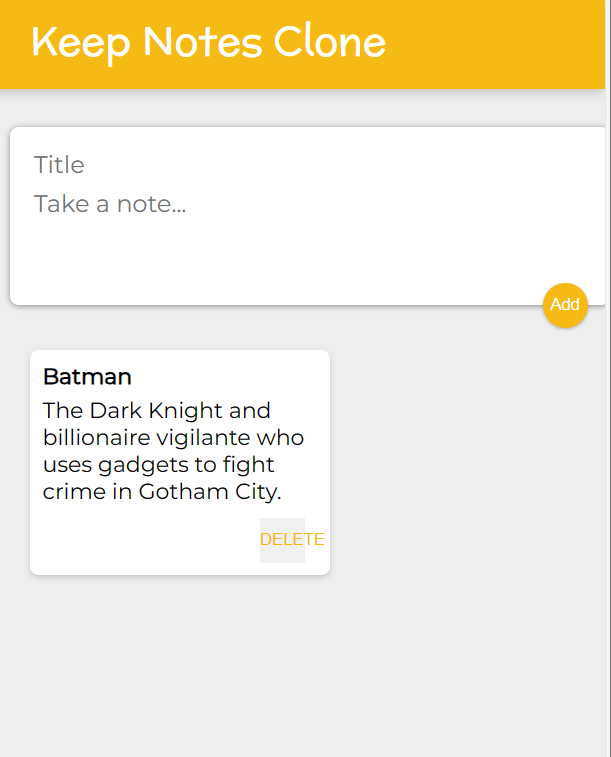
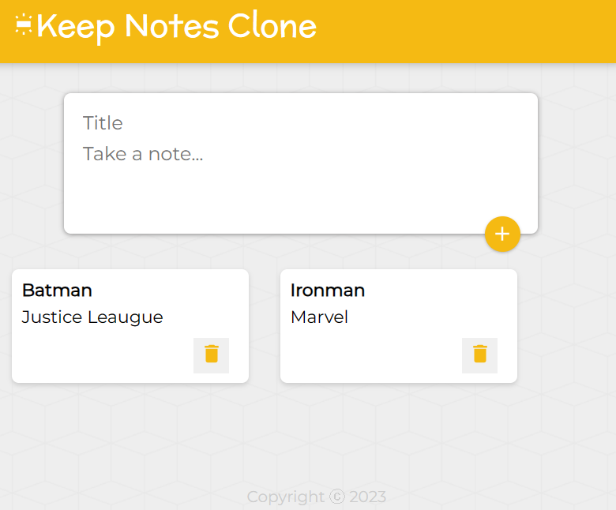
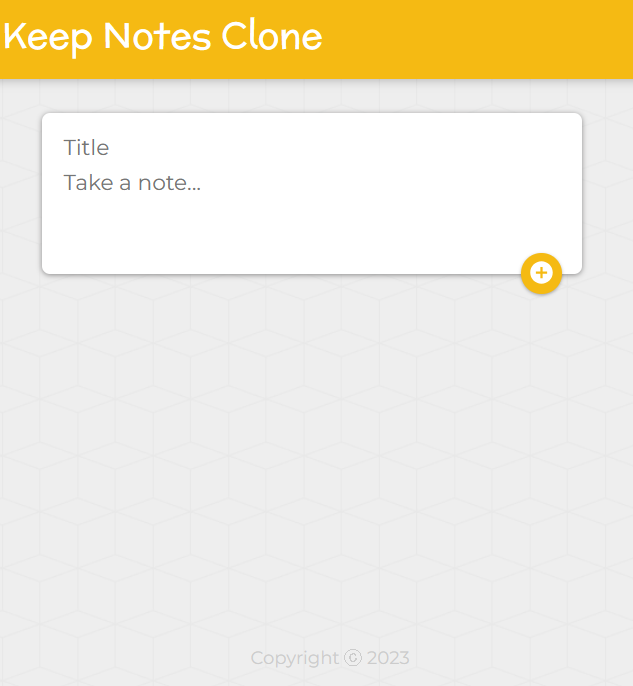
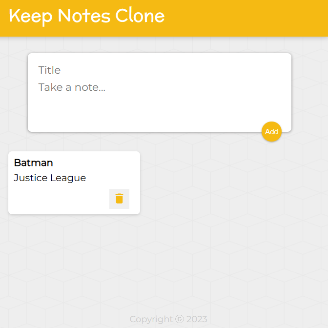
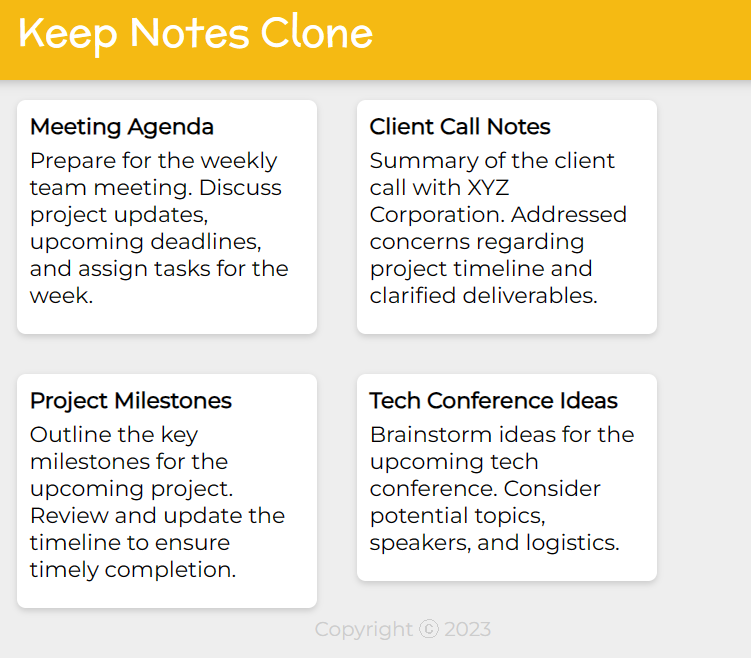
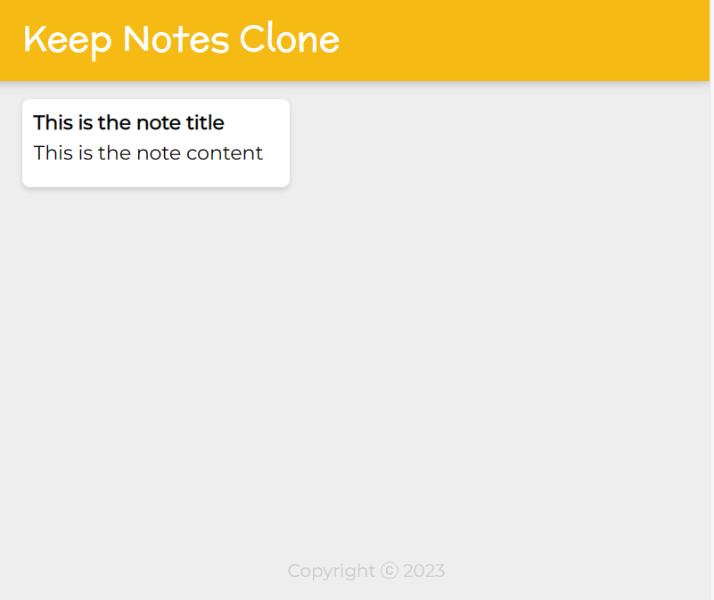

# Keep Notes Clone

**Version 3: Design Update and Component Enhancements**
A simple clone of Google Keep built using React, with improvements in design and added components.


**Version 2: Design Update and Component Enhancements**

A simple clone of Google Keep built using React, with improvements in design and added components.


## Updates

- **Design Enhancements:**
  - Modernized color scheme.
  - Improved layout and spacing for better readability.

**Version 1: Initial Design**

A simple clone of Google Keep built using React. This is the first version, showcasing the initial design. Future updates will include improvements to both design and functionality.


## Description

Keep Notes Clone is a web application created with React that emulates the basic functionality of Google Keep. It provides a straightforward and intuitive user interface for creating, organizing, and managing notes.

## Features

- Create, edit, and delete notes
- Organize notes with labels
- User-friendly drag-and-drop functionality
- Responsive design for various screen sizes

## Installation

1. Clone the repository:

   ```bash
   git clone https://github.com/yourusername/Keep-Notes-Clone.git
   cd Keep-Notes-Clone
   ```

2. Dependencies:

   ```bash
    react
    react-dom
    react-scripts
    material-ui/core
    material-ui/icons
   ```

## Screenshots:

<div align="center">
  
  
   
    
     
</div>
