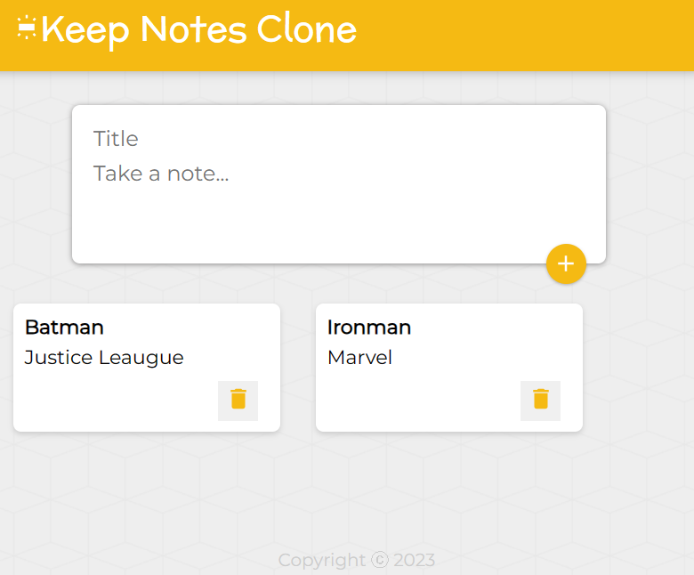
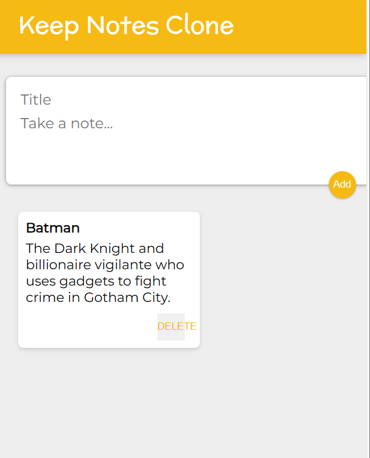
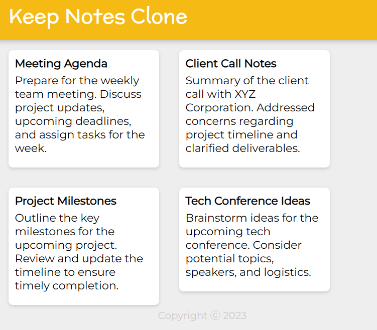
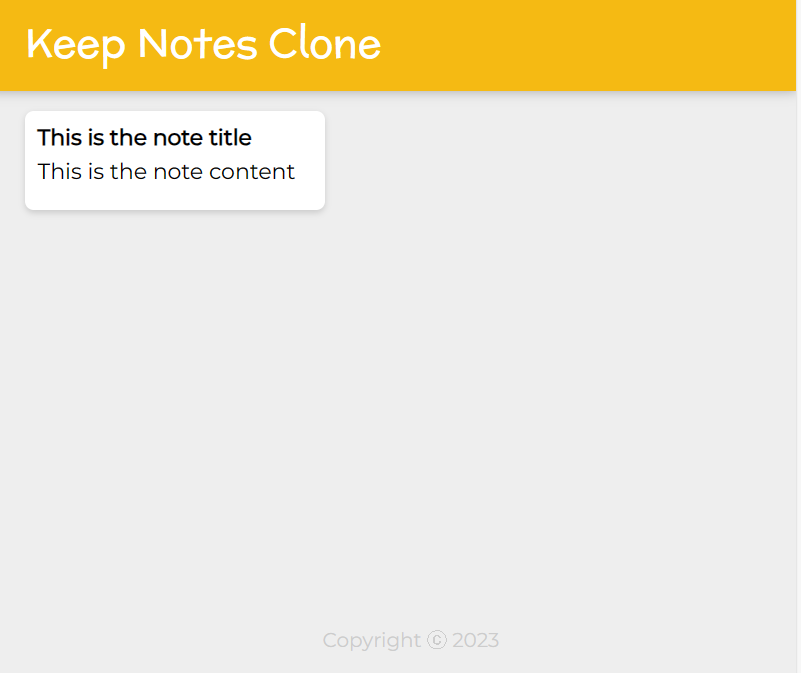
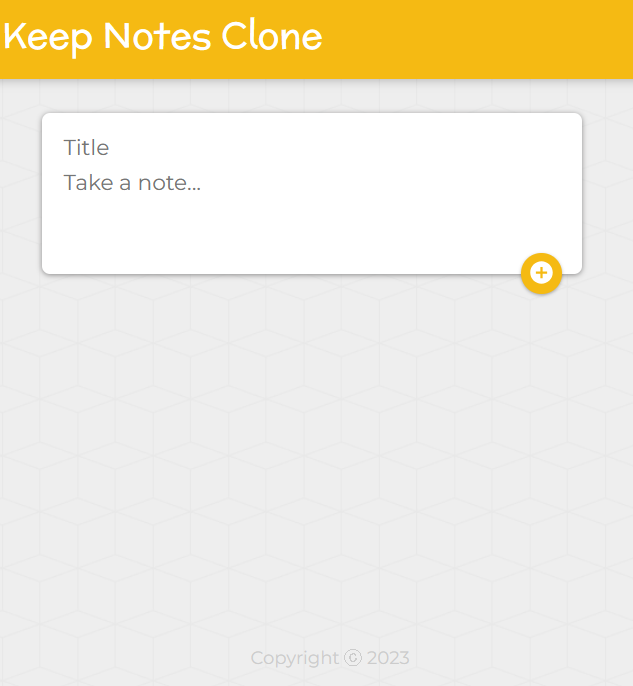
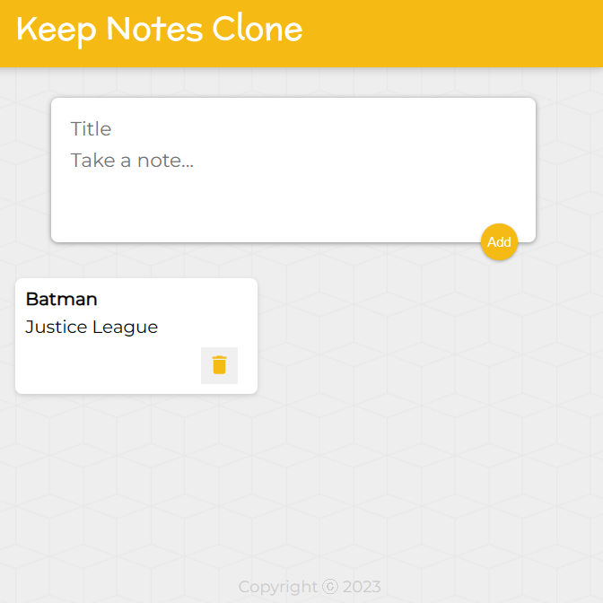

# Keep Notes Clone


## Final Version : Design Update and Component Enhancements

A simple clone of Google Keep built using React, with improvements in design and added components.


## Features

- **Material UI Icons:** Updated the design by incorporating Material UI icons for a more modern and cohesive look.

- **Zoom and FAB from Material UI:** Applied Material UI's Zoom component for a smoother user experience and added Material UI Floating Action Buttons (FAB) for quick actions.


**Version 3: Design Update and Component Enhancements**
A simple clone of Google Keep built using React, with improvements in design and added components.


**Version 2: Design Update and Component Enhancements**

A simple clone of Google Keep built using React, with improvements in design and added components.


## Updates

- **Design Enhancements:**
  - Modernized color scheme.
  - Improved layout and spacing for better readability.

**Version 1: Initial Design**

A simple clone of Google Keep built using React. This is the first version, showcasing the initial design. Future updates will include improvements to both design and functionality.


## Description

Keep Notes Clone is a web application created with React that emulates the basic functionality of Google Keep. It provides a straightforward and intuitive user interface for creating, organizing, and managing notes.

## Features

- Create, edit, and delete notes
- Organize notes with labels
- User-friendly drag-and-drop functionality
- Responsive design for various screen sizes
- Multi-user support with authentication (register/login)
- Per-user private notes (each user can only access their own notes)
- Backend REST API with persistent SQLite storage

## Installation

1. Clone the repository:

   ```bash
   git clone https://github.com/yourusername/Keep-Notes-Clone.git
   cd Keep-Notes-Clone
   ```

2. Dependencies:

   ```bash
    react
    react-dom
    react-scripts
    material-ui/core
     material-ui/icons
    ```

3. Install backend dependencies:

   ```bash
   npm install
   ```

## Run (2026 Multi-User Mode)

### 1) Start backend API

```bash
npm start
```

Backend runs on: `http://localhost:5000`

### 2) Start frontend

Run your existing frontend React dev workflow and ensure it can reach:

`http://localhost:5000`

If needed, set:

```bash
REACT_APP_API_URL=http://localhost:5000
```

## Backend API

- `POST /api/auth/register` → create user
- `POST /api/auth/login` → login user
- `GET /api/me` → current authenticated user
- `GET /api/notes` → list current user notes
- `POST /api/notes` → create note
- `PUT /api/notes/:id` → update note (owned by current user)
- `DELETE /api/notes/:id` → delete note (owned by current user)

## Screenshots:

<div align="center">
  
  <br>
  
   
    
     
</div>
